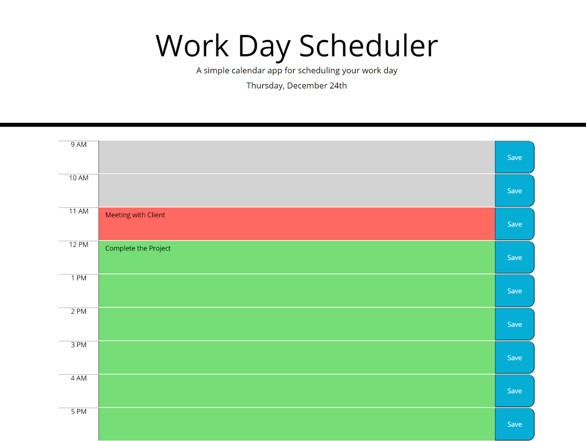

# Day-Planner
## Contents

* [Introduction](#Introduction)
* [Technologies](#Technologies)
* [Screenshot](#Screenshot)
* [Link](#Link)

## Introduction

The Day Planner project is a  calendar application that allows a user to save events for each business hour of the day so that user can manage time effectively. In this porject each time block is color-coded to indicate whether it is in the past(grey), present(orange) or future(green).The  event is saved in local storage. Therefore, if user refresh the page the saved events still persist.

## Technologies

Project is created with:

* Visual Studio Code 1.51.1
* Jquery 3.2.1
* Moments.js 2.24.0

## Screenshot

## Link

[Day Planner](https://panwaramita.github.io/Day-Planner/)